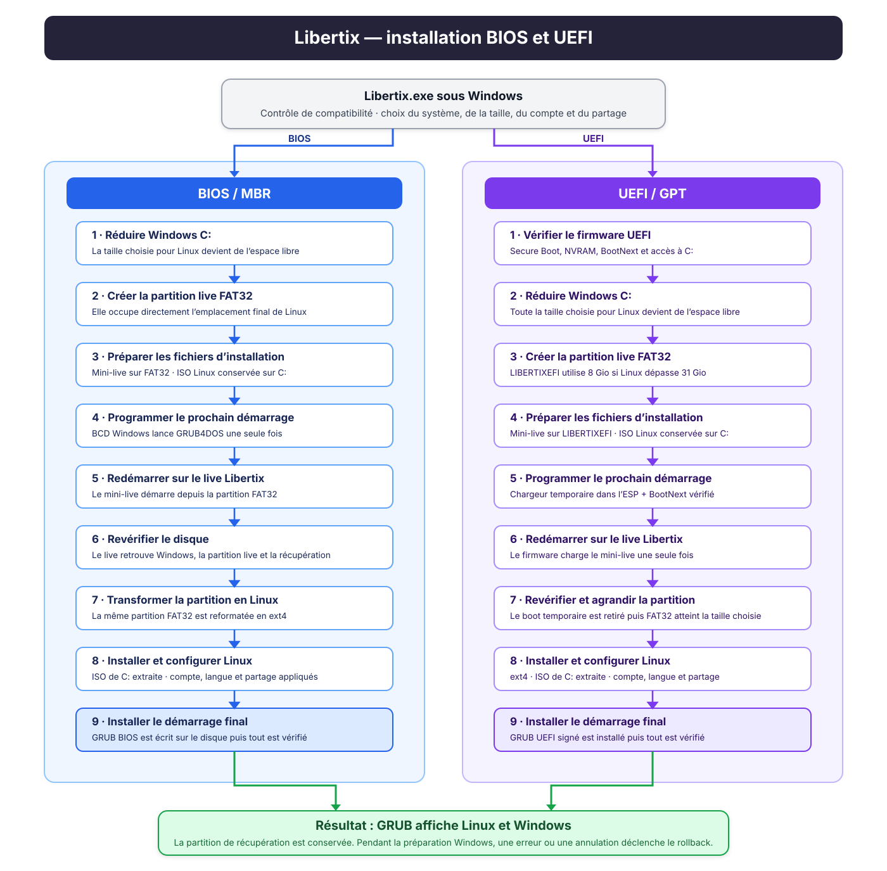
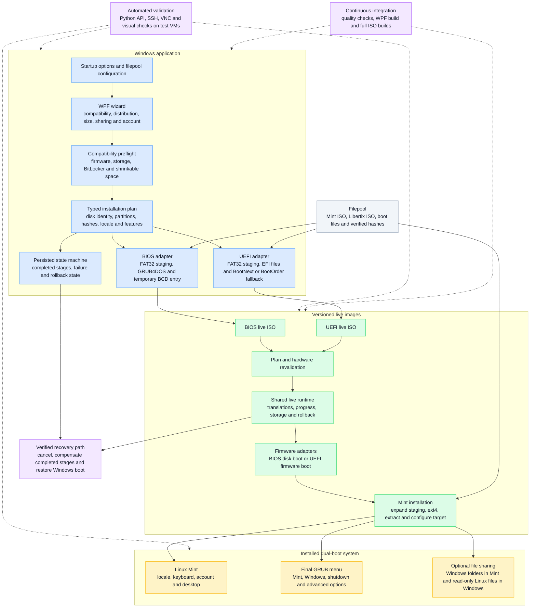

# Libertix

Libertix is a Windows application that installs Linux Mint alongside an existing Windows system.
It handles the Windows-side preparation, boots a purpose-built live environment, installs Mint and
configures a dual-boot menu for either BIOS/MBR or UEFI/GPT machines.

> [!WARNING]
> Libertix modifies disk partitions and boot configuration. Back up important data before using it.
> The compatibility checks deliberately reject layouts that cannot be handled safely.

## What Libertix does

1. Checks the firmware, disk layout, storage controller, available memory, BitLocker state and
   shrinkable space before changing the disk.
2. Builds and persists one installation plan describing the selected disk, Windows and Recovery
   partitions, requested Linux size, staging size and expected file hashes.
3. Shrinks the Windows partition while preserving the detected Recovery partition.
4. Creates a temporary FAT32 staging partition and configures a one-time boot into the matching
   Libertix live image.
5. The live environment verifies the plan again, expands the staging partition to the requested
   Linux size, formats it as ext4 and installs Linux Mint.
6. Installs the final GRUB bootloader and adds Linux Mint, Windows, shutdown and advanced options to
   the boot menu.
7. Records each completed stage so an intercepted cancellation or failure can run and verify the
   appropriate rollback.

The BIOS and UEFI paths produce separate ISO images, but share the installation plan, size rules,
state tracking, target configuration and rollback logic. Only the firmware-specific boot operations
remain separate.



## Architecture overview

Libertix is split into three execution environments: the Windows application prepares the machine,
a small live system performs the Linux installation, and the installed system receives the final
boot and sharing configuration. BIOS and UEFI use separate boot adapters, while the safety rules,
installation plan, state tracking and most live operations are shared.



### Main responsibilities

- `Libertix.exe` owns user interaction, compatibility checks and the initial Windows-side
  preparation. It produces one validated installation plan instead of letting each firmware path
  calculate its own disk values.
- `Installation/` contains the typed plan, size policy, validation and persisted state machine used
  to keep BIOS and UEFI behavior consistent.
- `Pages/ApplyChanges.Bios.cs` and `Scripts/uefi/` are firmware adapters. They implement only the
  temporary boot operations that genuinely differ between BIOS and UEFI.
- `assets/live/` contains the shared live installer. The `iso/` and `iso-uefi/` directories add the
  minimum boot files and settings needed for their firmware.
- The recovery path reads the persisted state and compensates only operations that were completed;
  it then verifies the disk and boot state before reporting a successful rollback.
- `auto_tests/` builds and deploys the current working tree, controls the three authorized test VMs
  through SSH and VNC, and records visual and command-level evidence.

## Supported configuration

- Windows 10 or Windows 11, 64-bit
- BIOS with an MBR disk, or UEFI with a GPT disk
- .NET Framework 4.8
- Administrator privileges
- Linux Mint 22.3 Cinnamon
- At least 20 GiB of shrinkable space on the Windows system disk
- A storage layout accepted by the compatibility preflight

Libertix supports common local SATA/AHCI and NVMe system disks. It refuses ambiguous or unsafe
topologies such as Windows dynamic disks, Storage Spaces, USB system disks, VHD/iSCSI system disks,
unsupported RAID controllers and unsupported Intel RST/VMD or AMD RAID configurations.

BitLocker or Device Encryption must be fully decrypted before the live installer boots. Libertix
can request decryption and waits for it to finish. The detected Windows Recovery partition is kept
outside the Linux allocation and is checked again before the live environment writes to disk.

## Optional file sharing

The installer can expose Windows user folders in Mint and Linux user files in Windows. Linux files
are mounted read-only on Windows. Both directions are optional and selected before installation.

## Runtime configuration

The production executable uses this filepool by default:

```text
https://ekimia.fr/libertix
```

Development and test runs can override it for one process without changing the production default:

```powershell
.\Libertix.exe --filepool-base-url "http://127.0.0.1:8000/filepool"
```

The override must be an absolute HTTP or HTTPS URL without embedded credentials, query parameters or
fragments.

## Build the Windows application

Libertix targets WPF on .NET Framework 4.8. A complete build requires Visual Studio 2022 Build Tools
with the managed desktop workload, the .NET Framework 4.8 SDK and the .NET Framework 4.8 targeting
pack.

From a Developer PowerShell prompt:

```powershell
msbuild .\Libertix.sln /restore /m /p:Configuration=Release "/p:Platform=Any CPU"
```

The executable is written to `bin\Release\Libertix.exe`.

## Build the live ISO images

The BIOS and UEFI ISO images are rebuilt completely from versioned sources with the Docker builder.
The process does not repack an existing ISO and does not require `sudo` on the host.

```bash
./iso-tools/build-isos-docker.sh all
```

Build a single firmware variant with `bios` or `uefi` instead of `all`. Successful builds produce:

```text
libertix-installer-bios.iso
libertix-installer-uefi.iso
```

The builder verifies the embedded scripts, schemas, boot configuration, theme and required runtime
tools before accepting either image.

## Tests

The automated test service is located in `auto_tests`. Its runtime configuration is loaded from a
local `.env` file; `auto_tests/.env.example` documents the required fields.

```bash
cd auto_tests
python -m pip install --requirement requirements-dev.txt
python -m ruff check app tests
python -m ruff format --check app tests
python -m pytest --cov=app --cov-report=term-missing
```

The GitHub Actions workflow also validates Shell syntax, runs ShellCheck, parses the PowerShell
sources, builds `Libertix.exe` on Windows and builds both ISO images on trusted `dev` branch runs.
Successful workflow runs publish the WPF build and the verified ISO images as GitHub Actions
artifacts.

## Source layout

- `Installation/` — typed installation plan, validation, size policy and persisted state machine
- `Pages/ApplyChanges.*.cs` — Windows orchestration split by responsibility and firmware adapter
- `Scripts/modules/` — shared PowerShell plan, state, download, storage and rollback functions
- `Scripts/uefi/` — operations that are specific to UEFI preparation
- `assets/live/` — shared live installer runtime plus BIOS and UEFI adapters
- `iso/` and `iso-uefi/` — firmware-specific ISO build inputs
- `schemas/` — versioned JSON contracts for the plan and execution state
- `auto_tests/` — API, VM automation, visual checks and regression tests

Additional UEFI boot details are documented in
[`docs/UEFI_BOOTNEXT_BOOTORDER.md`](docs/UEFI_BOOTNEXT_BOOTORDER.md).

## Community and acknowledgements

Libertix is developed by Félix ([felix068](https://github.com/felix068)) and Ekimia, with
contributions from Michel Memeteau, MopigamesYT / Margot and Aamir Shahzad. Thank you to everyone
who has contributed code, tests, issue reports and documentation.

The project has also been made possible by its donors. Public supporters of the Libertix campaign
include **Olivier**, **Boyka**, **Coin des Geeks** and **Matthieu**. The campaign exceeded its
€3,000 goal through 41 donations. We are grateful to every donor, including those who chose to
remain anonymous.

To help fund continued development and testing, visit the
[Libertix donation campaign](https://ekimia.fr/donations/campagne-libertix/).

## Contributing

Development takes place on the `dev` branch. Keep firmware-neutral behavior in the shared plan and
runtime modules, and limit BIOS/UEFI adapters to operations that genuinely differ. Changes to disk
or rollback behavior should include parity tests for both firmware paths and a replay of the
relevant failure scenario where possible.

## License

Libertix is distributed under the GNU General Public License v3.0. See [`LICENSE`](LICENSE).

## Acknowledgments

- [Rose Pine](https://rosepinetheme.com/) for the application color palette
- [WPF](https://github.com/dotnet/wpf) for the Windows desktop framework
